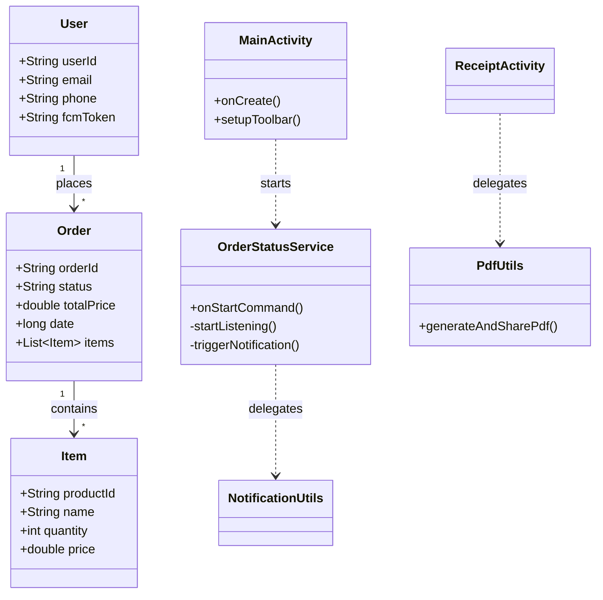

### Tasks to improve code

1. Try to use binding instead of findViewById 🧪
2. Work with Optional instead of null objects ✅
3. Add mappers from json to dto ✅
4. Work with Builder design pattern instead of new() 🧪
5. Fix splah screen with a better tmplementation ✅
6. Fix going out and in to the app with the new splash screen to not tap on login everytime ✅
7. Fix favorite items page refresh when deleting item from favorites, add listener like the one in the MMM networking course page 25 ✅
8. Copy popup cardviews dialog design from moneypitch ✅
9. Add go back arrow in activities for onbackpressed() ✅
10. Adding notifications to the application like moneypitch ✅
11. Adding background sevices to track the order notification in real time ✅
13. Try to better handling the user infos validations and regexes and centrelize all of them ✅
14. Do a better modalisation for our database, for the products, categories and orders ✅
15. Work with actions and usecases ✅
16. Work with delegate methods instead of hard coding everything inside the classes ✅
17. Try to improve all the firebase query functions and opttimize the loops ✅
18. Try to delete all the firebase logic from the controllers and adapters ✅
19. Try to apply demeter low for not accessing object from outside our class & function ✅
20. Refactor all the popup dialogs in one place and use it as a static function, just like moneypitch ✅
21. Try to centrelize the changement colors of the status/navigation bar ✅
22. Try to add biometric to authenticate instead of always the login and password 🧪
23. Double click to go out from the app ✅
24. Activities finish afinitiny gestion in navigations and going back ✅
25. Deploy the apk in a free & fast hosting 🧪
26. Improve all the design & the images & colors & illustrations ✅
27. Refactore colors file and deleting unused colors ✅
28. i11n and making the app compatible with multiple languages 🧪
29. Add possibility to send receit by mail, and download it as pdf ✅
30. Add possibility to see order status in the ordersActivity to know from the outside the delivery status of this order without clicking ✅

-----

Here is a comprehensive **README.md** file tailored for your school project. It is written in a professional, technical style to satisfy your teacher's requirements, highlighting the architecture, design patterns (Delegation, Single Responsibility), and advanced features we discussed.

You can copy-paste this directly into your GitHub repository `README.md` file.

-----

# Estore-ISTIC 📱🛒

**Estore-ISTIC** is a robust, native Android e-commerce application developed as part of the [Course Name/Year] curriculum at ISTIC. This project demonstrates advanced Android development practices, including **Serverless Architecture** (Firebase), **Real-time Data Sync**, **Background Services**, and a clean **Delegation Architecture**.

The app provides a seamless shopping experience allowing users to browse products, track orders in real-time, receive background notifications, and generate PDF receipts.


-----

## 🏗️ Architecture & Design Patterns

The project follows a strict **Separation of Concerns (SoC)** principle, dividing the code into distinct layers to ensure maintainability and testability. We moved away from the "God Activity" anti-pattern by using **Delegation** and **Helper Classes**.

### 1\. Package Structure

The code is organized by feature and responsibility:

```text
estore.istic.fr
├── View/             # Activities & Fragments (UI Logic only)
├── Services/         # Background Services (OrderStatusService, FCM)
├── Utils/            # Helper classes (PdfUtils, DialogUtils, NotificationUtils)
├── Models/           # POJO Data Classes (Order, User, Product)
└── Resources/        # UI resources (Animations, Drawables)
```

### 2\. Delegation Pattern

Instead of Activities handling everything, specific tasks are **delegated** to specialized classes. This keeps `MainActivity` and other views clean.

  * **UI Delegation:** `ToolbarHelper` handles the App Bar setup, clicks, and custom fonts for every activity.
    ```java
    // In any Activity, we just call one line:
    ToolbarHelper.setup(this, "My Cart", true);
    ```
  * **Permission Delegation:** `NotificationsPermissionHandler` manages the complex Android 13+ permission flow, decoupling it from the business logic.
  * **PDF Delegation:** `PdfUtils` handles the low-level Canvas drawing and file I/O, keeping the `ReceiptActivity` focused only on data binding.

-----

## 🚀 Key Features & Implementation

### 1\. 🔔 Smart Background Notifications

The app monitors order status changes even when the app is **killed** or in the **background**.

  * **Logic:** A `Service` (`OrderStatusService`) runs in the background and attaches a `ChildEventListener` to the Firebase Realtime Database.
  * **Optimization:** It uses `START_STICKY` to ensure the OS restarts the service if it's killed to reclaim memory.
  * **Permissions:** Handles Android 13 `POST_NOTIFICATIONS` runtime permissions gracefully.

<!-- end list -->

```java
// Snippet: Service listening for changes
ordersRef.addChildEventListener(new ChildEventListener() {
    @Override
    public void onChildChanged(@NonNull DataSnapshot snapshot, ...) {
        Order order = snapshot.getValue(Order.class);
        NotificationUtils.createNotification(context, "Order Update", "Status: " + order.getStatus());
    }
});
```

### 2\. 🧾 PDF Receipt Generation & Sharing

Users can download a physical proof of purchase.

  * **Technique:** The app renders the **entire scrollable view** (not just the visible part) onto a PDF Canvas.
  * **Sharing:** Uses `FileProvider` to securely share the generated PDF to other apps (WhatsApp, Gmail, Drive).
  * **UI:** Implements a "Ticket" layout with jagged edges and cutouts using custom Drawables (`layer-list` and masks).

### 3\. 🔐 Authentication & Security

  * **OTP Verification:** Secure phone number authentication using Firebase Auth.
  * **Password Recovery:** "Forgot Password" flow triggers an email reset link via Firebase.
  * **Auto-Login:** Splash screen checks valid session tokens before launching the main app.

### 4\. 📦 Real-time Order Tracking

  * The "Order History" screen updates instantly without pulling-to-refresh.
  * **RecyclerView:** Uses a `ListAdapter` with `DiffUtil` (implied) or efficient binding to handle list updates smoothly.
  * **Multi-item Handling:** Logic to display "Sony Headphones + 2 other items" to keep the UI clean.

### 5\. ❤️ Favorites & Search

  * **Favorites:** Local persistence (or cloud sync) of liked items.
  * **Search:** Real-time filtering of the product list adapter based on query text input.

-----

## 📊 Database & Class Diagram (Mermaid)

The application uses **Firebase Realtime Database / Firestore**. Below is the entity relationship and class interaction diagram.



-----

## 🛠️ Technical Stack

  * **Language:** Java (Native Android)
  * **Minimum SDK:** API 24 (Android 7.0)
  * **Target SDK:** API 34 (Android 14)
  * **Architecture:** MVC / Delegation
  * **Database:** Firebase Realtime Database & Firestore
  * **Auth:** Firebase Authentication (Email/Password, Phone OTP)
  * **UI Components:** `ConstraintLayout`, `NestedScrollView`, `MaterialComponents`, `LottieAnimations`

-----

## 📥 Setup Instructions

1.  **Clone the Repo:**
    ```bash
    git clone https://github.com/abdelaliichou/Estore-ISTIC.git
    ```
2.  **Firebase Setup:**
      * Add your `google-services.json` file to the `/app` folder.
      * Enable **Authentication** (Email & Phone) and **Realtime Database** in your Firebase Console.
3.  **Build:**
      * Sync Gradle files.
      * Run on an Emulator or Physical Device (API 33+ recommended for notification testing).

-----

## 👤 Author

**Abdelali Ichou**

  * **University:** ISTIC (University of Rennes 1)
  * **GitHub:** [@abdelaliichou](https://github.com/abdelaliichou)

-----

*Project created for educational purposes demonstrating native Android lifecycle management, service-based architecture, and professional UI/UX design.*
