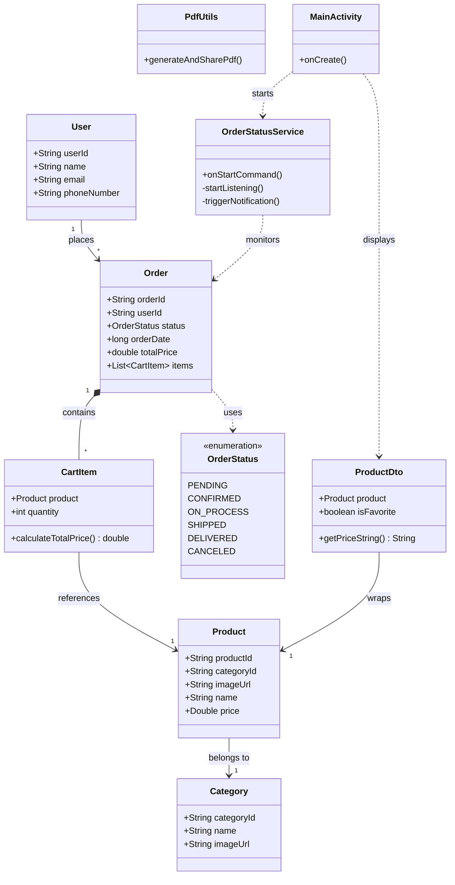
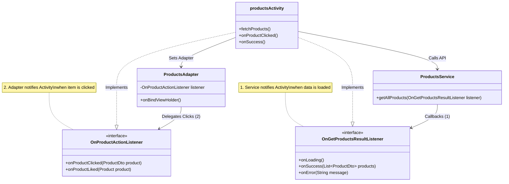
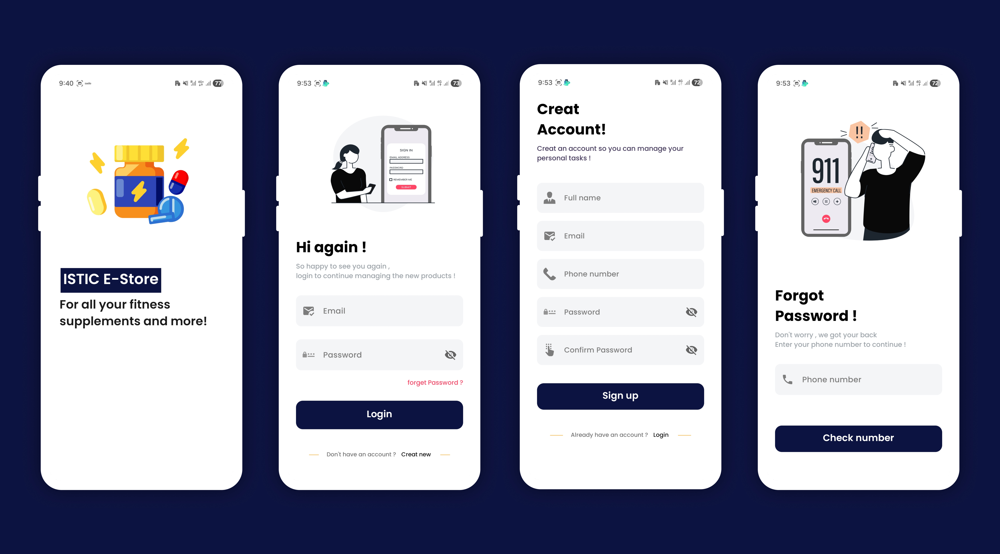
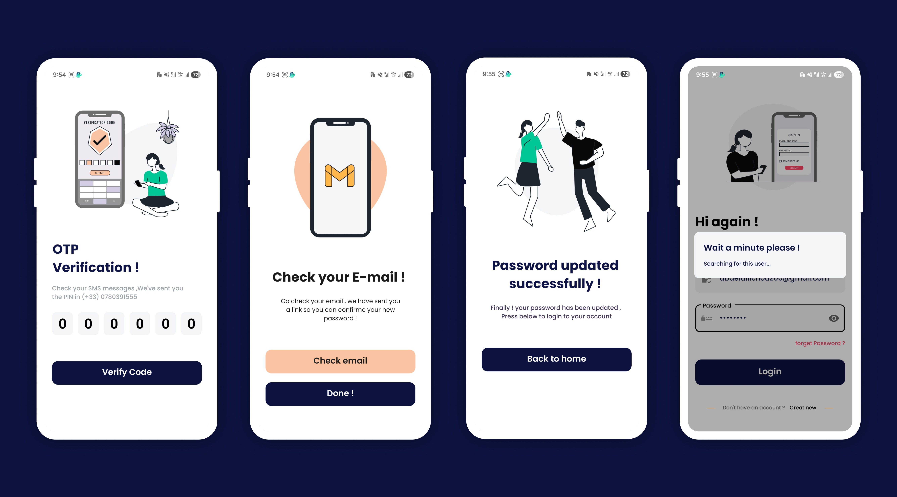
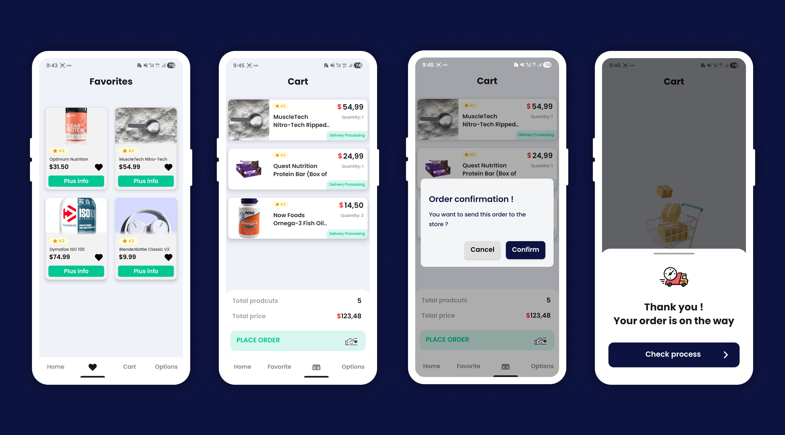
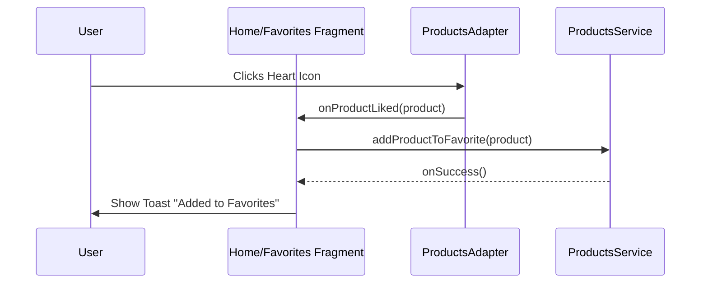
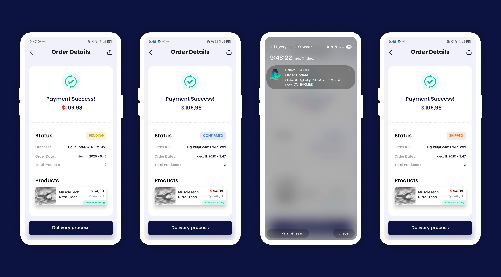
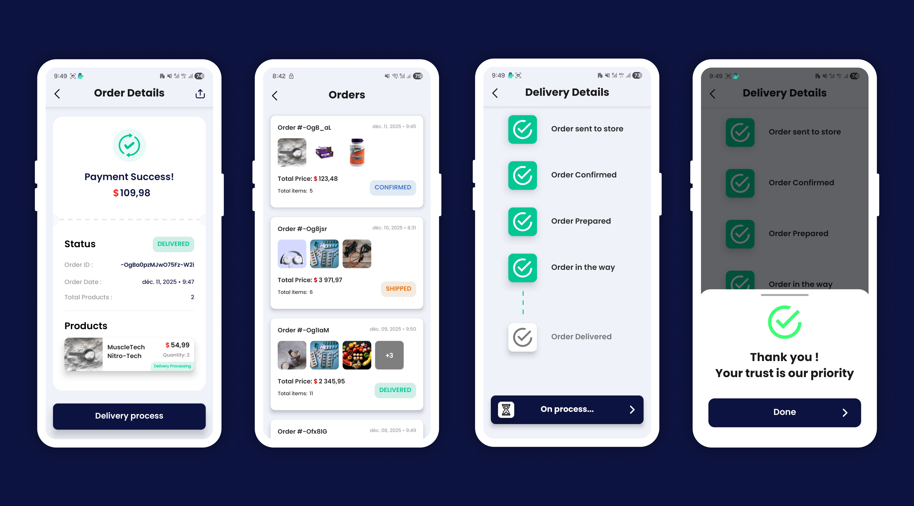
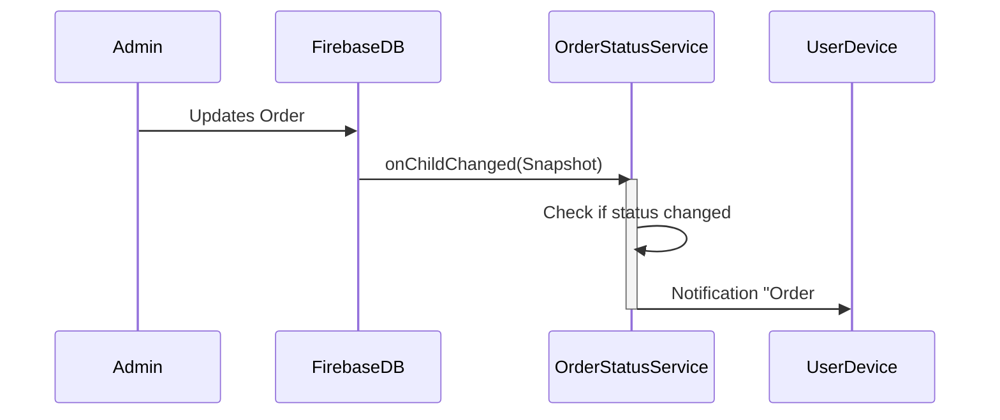

# Estore-ISTIC 📱🛒

**Estore-ISTIC** is a robust, native Android e-commerce application developed as part of the [MMM/2025] course at ISTIC. This project demonstrates advanced Android development practices, including **Serverless Architecture** `Firebase`, **Real-time Data Sync**, **Background Services**, **Responsive Moderne UI**, and a clean **Delegation Architecture**.

The app provides a seamless shopping experience allowing users to browse products, add to favorite/cart, track orders in real-time, receive background notifications, and generate PDF receipts.


## 👤 Authors

- **Abdelali Ichou**
- **Gregoire Bodin**
- **Leo Bernard Bodier**
- **Barry Mamadou Hady**

* **University:** ISTIC (University of Rennes 1)

-----


* **Lien de tous les pages de l'application:** [Google drive images](https://drive.google.com/drive/folders/1evJ_s_1fZ__RbmefrMbx3nCqX-58agfD?usp=sharing)
* **Lien de les maquettes Figma:** [Figma](https://www.figma.com/design/2T2R7ytlx4kiE8bX1Kg77P/Android-Mockup--Community-?node-id=1-126&t=9DqcM3PYpiYEEJTX-1)


-----

## Database & Class Diagram

The application uses **Firebase Realtime Database / Firestore**. Below is the entity relationship and class interaction diagram.

- **The complete properties** for `User`, `Product`, `Order`, and `Category`.
- **The Relationships**: Connecting `Product` to `Category`, `CartItem` to `Product`, and `Order` to `CartItem`.
- **The Enum**: Added the `OrderStatus` enumeration used inside the Order class.
- **The DTO**: Added `ProductDto` which wraps the product for UI logic (favorites).



-----

## Technical Stack

* **Language:** Java (Native Android)
* **Minimum SDK:** API 24 (Android 7.0)
* **Target SDK:** API 34 (Android 14)
* **Architecture:** MVC / Delegation
* **Database:** Firebase Realtime Database
* **Auth:** Firebase Authentication (Email/Password, Phone OTP)
* **UI Components:** `Animations`, `Responsive Design`, `LottieAnimations`, `imageSlider`, `Alert Dialogs`, `Shimmer Effects`

-----

## Architecture & Design Patterns

The project follows a strict **Separation of Concerns (SoC)** principle, dividing the code into distinct layers to ensure maintainability and testability. We moved away from the "God Activity" anti-pattern by using **Delegation** and **Helper Classes**.

### 1\. Package Structure

The code is organized by feature and responsibility:

```text
estore.istic.fr
├── Controllers/      # Recycler views adapter & Pdf generation
├── Facade/           # All the interfaces of the delegation logic
├── View/             # Activities & Fragments (UI Logic only)
├── Services/         # Background Services (User-Products-Orders Service, FCM)
├── Utils/            # Helper classes (PdfUtils, DialogUtils, NotificationUtils)
├── Models/           # Domain & Dto Data Classes (Order, User, Product)
└── Resources/        # UI resources (Animations, Drawables)
```

### 2\. Delegation Pattern

Instead of Activities handling everything, specific tasks are **delegated** to specialized classes. This keeps `Activity` and other views clean.

  * **Service Delegation:** `ProductsService` fetching data and notifying `productsActivity` via `OnGetProductsResultListener`.
  * **Adapter Delegation:** `ProductsAdapter` detecting clicks and notifying `productsActivity` via `OnProductActionListener`.



-----

## Different Application Modules

### 1\. Authentication & Security Architecture





**A. Using The Delegation Pattern**

Instead of writing `Firebase` code directly inside `LoginActivity` or `SignUpActivity`, we use a dedicated `UserService` class.

- `The View (Activity)`: Responsible only for handling user input (clicks, text entry) and updating the UI (showing loaders, navigation).

- `The Interface (Delegate)`: Defines the contract for success or failure.

- `The Service (Logic)`: Executes the Firebase commands and notifies the View via the Interface.

    ```mermaid
    sequenceDiagram
        participant User
        participant LoginActivity as View (UI)
        participant UserService as Service (Logic)
        participant Firebase as Firebase Auth
    
        User->>LoginActivity: Enters Credentials & Clicks Login
        LoginActivity->>UserService: loginUser(email, pass, listener)
        activate UserService
        UserService->>Firebase: signInWithEmailAndPassword()
        
        alt Success
            Firebase-->>UserService: Auth Result (User)
            UserService-->>LoginActivity: listener.onLoginSuccess()
            LoginActivity->>User: Navigate to Home
        else Failure
            Firebase-->>UserService: Exception
            UserService-->>LoginActivity: listener.onLoginError(message)
            LoginActivity->>User: Show Error Toast
        end
        deactivate UserService
    ```

**B. Code Implementation Snippets**

- **The Delegation Interface:**  This interface allows the UserService to communicate back to any activity without knowing which activity it is.
    ```java
    // Facade/AuthListener.java
    public interface AuthListener {
        void onSuccess(User user);
        void onError(String message);
    }
    ```

- **The Service Logic `(UserService.java)`:** Handles the asynchronous Firebase calls.
    ```java
    public class UserService {
        public static void loginUser(
                String email,
                String password,
                AuthListener listener
        ) {
            FirebaseAuth.getInstance().signInWithEmailAndPassword(email, password).addOnCompleteListener(task -> {
                    if (task.isSuccessful()) {
                        // Notify the UI through the delegate
                        listener.onSuccess(task.getResult().getUser());
                    } else {
                        listener.onError(task.getException().getMessage());
                    }
            });
        }
    }
    ```

- **The View Implementation `(LoginActivity.java)`:** The Activity implements the listener or passes it anonymously, keeping the UI logic clean.
    ```java
    loginBtn.setOnClickListener(v -> {
        showLoadingDialog();
        userService.loginUser(email, password, new AuthListener() {
            @Override
            public void onSuccess(FirebaseUser user) {
                hideLoadingDialog();
                navigateToHome();
            }
        
            @Override
            public void onError(String error) {
                hideLoadingDialog();
                DialogUtils.showErrorDialog(context, error);
            }
        });
    });
    ```

**C. Authentication Workflows (UI/UX)**

- **Sign Up & Sign In:**
   - Sign Up: Collects user data (Full Name, Email, Phone) to populate the users collection in Firebase realtime database.

   - Sign In: Features a welcoming UI. It includes a "Searching for this user..." loading state to provide feedback during network latency.


- **Advanced Password Recovery (Hybrid Flow):**

    We implemented a secure recovery flow that combines SMS OTP and Email Verification.

   - **Step 1: Identity Verification (Phone):** When a user forgets their password, they must first verify their identity using their registered phone number.

   - **Step 2: OTP Verification:** The system sends a 6-digit SMS code. The `OtpActivity` features a custom input layout.
     - Security: This prevents unauthorized users from spamming email reset links to victims.

   - **Step 3: Secure Reset Link:** Once the OTP is verified, the system triggers a Firebase Password Reset email.

   - **Step 4: Success State:** After resetting via the link, the user is greeted with a `"Password Updated Successfully"` confirmation screen before being redirected to login.

-----

### 2\. Core Shopping Experience & Navigation Architecture

The core application uses a **Single-Activity Architecture** where `MainActivity` acts as the host container for four primary Fragments which ensures smooth navigation and state preservation.




#### A. Host Activity Architecture (`MainActivity`)
The `MainActivity` does not contain business logic. Its sole responsibility is to orchestrate navigation using an `AnimatedBottomBar` and manage the fragment lifecycle.

* **Navigation Logic:** We use a `switch-case` strategy to replace the FrameLayout container with the selected Fragment (`homeFragment`, `cartFragment`, `favoritesFragment`, `optionsFragment`).
* **Double-Back Safety:** To prevent accidental exits, we implemented a custom `OnBackPressedDispatcher` callback that requires two rapid clicks to quit the app.

    ```mermaid
    graph TD
        User --> MainActivity
        MainActivity -->|Tab Select| FragmentContainer
        FragmentContainer --> HomeFragment
        FragmentContainer --> CartFragment
        FragmentContainer --> FavoritesFragment
        FragmentContainer --> ProfileFragment
    ```

#### B. Product Discovery & Filtering Logic

The `Home Fragment` is the central hub for product discovery, implementing intelligent data partitioning and real-time filtering.

- **Smart Data Partitioning:**
Instead of making multiple API calls, we fetch all products once and use Java Streams to partition them efficiently on the client side.

    ```Java
    Map<Boolean, List<ProductDto>> partitionedProducts = products.stream().collect(
        Collectors.partitioningBy(p -> p.getProduct().getPrice() >= 600)
    );
    
    populaireProductsAdapter.updateList(partitionedProducts.get(true));
    
    allProductsAdapter.updateList(partitionedProducts.get(false));
    ```

- **Search & Auto-Complete `(productsActivity.java)`:**

    We implemented a robust search feature using an AutoCompleteTextView.

   - **Real-time Listener:** A TextWatcher triggers a filter request to the ProductsService as the user types.

   - **Smart Fallback:** If the search field is cleared, the listener automatically re-fetches the full product list to restore the default view.

- **Category Filtering:**

    Delegation is used to handle category clicks. When a category is selected in the `CategoriesAdapter`, it fires the `onCategoryClicked interface`, prompting the `ProductsService` to return a `filtered list` of products matching that specific category ID.

#### C. Product Interaction & Details
The `productDetailsActivity` acts as a standalone view for deep interaction. It handles complex state management for:

- **Dynamic UI**

- **Favorite Toggling:** Uses the `OnFavoriteProductsModifiedListener` to provide immediate visual feedback (Add to favorites Heart) while asynchronously updating the database.

- **Delegation in Action `(The OnProductActionListener)`:** This interface is the bridge between our RecyclerView adapters and the UI Controllers.

    ```Java
    public interface OnProductActionListener {
        void onProductClicked(ProductDto product);
        void onProductLiked(Product product);
        void onProductDisliked(Product product);
    }
    ```

- **Why we use it:** It allows the ProductsAdapter to remain `"dumb."` It doesn't know what happens when a product is clicked, it just notifies the listener, which then decides whether to open details, toast a message, or update the database.

#### D. The Cart System (cartFragment)

The Cart module is fully `Reactive`. Unlike traditional apps that fetch the cart once, our `cartFragment` attaches a `Real-Time` Listener to the user's cart node in `Firebase`.

- **Live Updates:** If an item is modified from another device or screen, the `OnCartRealTimeListener` triggers `onData()`, immediately refreshing the UI and recalculating the total price.

- **Calculations:**

    ```Java
    public double getTotalPrice(List<CartItem> cartItems) {
        return cartItems.stream()
        .mapToDouble(CartItem::calculateTotalPrice)
        .sum();
    }
    ```

**Checkout Process:** The Pay button triggers a confirmation dialog. Upon success:

When a user confirms their cart, the `OrdersService` performs a transactional operation:
- **Register:** Saves the `Order` via `OrdersService`.
- **Clear:** Removes all items the cart (`cleared`) locally and remotely.
- **Navigate:** Redirects the user to the `orderDetailsActivity` with a flag `isLast=true` to immediately fetch the newly created order ID.


#### E. Favorites Logic (favoritesFragment)

The Favorites module demonstrates efficient list filtering.

- **Logic:** It fetches the full product list but applies a stream filter `filter(ProductDto::isFavorite)` before passing data to the `adapter`.

- **Synchronization:** Since it implements `OnProductActionListener`, disliking an item directly removes it from the view in `real-time` without needing a manual refresh.



-----

### 3. Orders Management & Tracking





This module represents the most complex part of the **Estore-ISTIC** application. It integrates **Real-time Database Listeners**, **Background Services**, and **PDF Generation** to provide a complete `Place Order to Delivery` lifecycle.

**A. Placing an Order (`cartFragment`):**

**B. Visual Order Tracking (`trackingOrdersActivity`):**

We implemented a **Stepper UI** to visualize the delivery process (`Pending` → `Confirmed`  → `On_Process` → `Shipped` → `Delivered`).
- **Dynamic Binding:** The `OrdersService.trackOrderDeliveryStatus()` method attaches a listener to the specific order ID.

- **UI Logic:** The `updateDeliveryUI()` function calculates the current step index and dynamically tints the progress bars and icons.

**C. The "Digital Receipt" System**

We moved beyond standard list views to create a `Ticket-Style` digital receipt that can be exported physically.

- #### PDF Export & Sharing (`PdfUtils`)

  * **Technique** Users can generate a high-quality PDF of their receipt.
  * **Sharing:** Uses `FileProvider` to securely share the generated PDF to other apps (WhatsApp, Gmail, Drive).
  * **UI:** Implements a "Ticket" layout with jagged edges and cutouts using custom Drawables (`layer-list` and masks).


- #### Background Order Monitoring `(Notifications)`

  - This feature ensures users never miss an update.

    - The Firebase Listener Service (`OrderStatusService`)

  - This is a persistent Android Service that starts when the app launches (`START_STICKY`).

  - **ChildEventListener:** Unlike a `ValueEventListener` that downloads the whole list, this listener specifically watches for `onChildChanged`. This means it only triggers when a *specific* order is modified.

- #### Notification Trigger

  - When the service detects a change (ex: from `Pending` to `Confirmed`):

    - The (`OrderStatusService`) runs in the background and attaches a `ChildEventListener` to the Firebase Realtime Database.
    - It extracts the `Order ID` and `New Status`.
    - Tapping the notification deep-links the user directly to the app.

```java
ordersRef.addChildEventListener(new ChildEventListener() {
    @Override
    public void onChildChanged(@NonNull DataSnapshot snapshot, ...) {
        Order order = snapshot.getValue(Order.class);
        NotificationUtils.createNotification(context, "Order Update", "Status: " + order.getStatus());
    }
});
```



---

**D. Delegation in Orders**

We maintain strict separation of concerns using interfaces:

- **`OnOrderSaveListener`:** Handles the asynchronous result of placing an order (`Success`/`Error`/`Loading`).
- **`OnGetOrderListener`:** Fetches a single order details without exposing the `DataSnapshot` complexity to the Activity.
- **`OnGetAllOrdersListener`:** Used by the `OrdersAdapter` to populate the history list.

This architecture allows us to swap the backend implementation easily in the future without changing a single line of code in the Activities.


----


### 4. User Profile & Account Management

The **Options Fragment** serves as the control center for user account settings, offering a centralized hub for profile management, support, and session control.


**A. Profile Management**

The `userProfileActivity` allows users to view and edit their personal information.
- **Data Fetching:** On launch, the `UsersService` asynchronously retrieves the user's data.
- **Updates:** Modifications are validated locally before being pushed to the server via `UsersService.updateUserData()`.

**B. Contact & Support**

The `contactUsActivity` leverages Android's implicit intents to seamlessly connect users with support channels:
- **Email:** Launches the user's default email client with a pre-filled subject line using `Intent.ACTION_SEND`.
- **Phone:** Initiates the dialer with the support number using `Intent.ACTION_DIAL`.
- **Social:** Opens the Facebook page directly in the browser or app using `Intent.ACTION_VIEW`.

**C. Secure Logout**

To prevent accidental sign-outs, we implemented a confirmation flow.
- **Confirmation:** Clicking logout triggers a reusable "Action Dialog" (`Utils.createActionDialog`) ensuring the user intended to exit.
- **Session Clearing:** Upon confirmation, `DatabaseHelper.getAuth().signOut()` is called to invalidate the session, and `finishAffinity()` ensures the user cannot return to the app via the back button without logging in again.


-----


#### Todo List

1. Try to use binding instead of findViewById 🧪
2. Work with Optional instead of null objects ✅
3. Add mappers from json to dto ✅
4. Work with Builder design pattern instead of new() 🧪
5. Fix splah screen with a better tmplementation ✅
6. Fix going out and in to the app with the new splash screen to not tap on login everytime ✅
7. Fix favorite items page refresh when deleting item from favorites, add listener like the one in the MMM networking course page 25 ✅
8. Copy popup cardviews dialog design from moneypitch ✅
9. Add go back arrow in activities for onbackpressed() ✅
10. Adding notifications to the application like moneypitch ✅
11. Adding background sevices to track the order notification in real time ✅
13. Try to better handling the user infos validations and regexes and centrelize all of them ✅
14. Do a better modalisation for our database, for the products, categories and orders ✅
15. Work with actions and usecases ✅
16. Work with delegate methods instead of hard coding everything inside the classes ✅
17. Try to improve all the firebase query functions and opttimize the loops ✅
18. Try to delete all the firebase logic from the controllers and adapters ✅
19. Try to apply demeter low for not accessing object from outside our class & function ✅
20. Refactor all the popup dialogs in one place and use it as a static function, just like moneypitch ✅
21. Try to centrelize the changement colors of the status/navigation bar ✅
22. Try to add biometric to authenticate instead of always the login and password 🧪
23. Double click to go out from the app ✅
24. Activities finish afinitiny gestion in navigations and going back ✅
25. Deploy the apk in a free & fast hosting 🧪
26. Improve all the design & the images & colors & illustrations ✅
27. Refactore colors file and deleting unused colors ✅
28. i11n and making the app compatible with multiple languages 🧪
29. Add possibility to send receit by mail, and download it as pdf ✅
30. Add possibility to see order status in the ordersActivity to know from the outside the delivery status of this order without clicking ✅


-----

*Project created for educational purposes demonstrating native Android lifecycle management, service-based architecture, and professional UI/UX design.*
